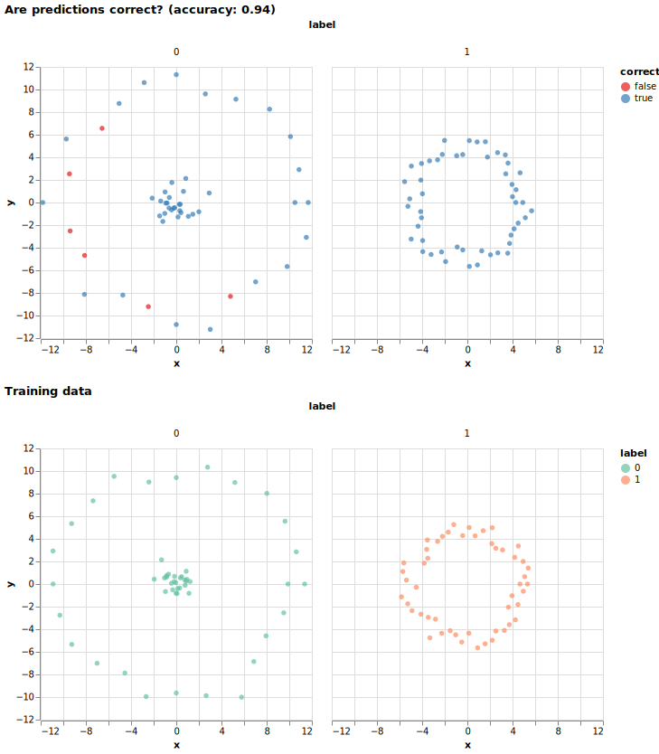

# 2D classification task using a nearest-neighbor predictor

Little example project we use in teaching.

This is part of https://coderefinery.github.io/reproducible-python-ml/.

## Example chart

## Purpose

This is to learn more about collaborative coding.

## Requirements

(dependencies and their versions or version ranges)

## Installation instructions

(...)

## Example

(copy-paste-able example)

## Documentation

- Tutorials covering key functionality
- Reference documentation (e.g. API) covering all functionality

## Authors and recommended citation

(...)

## License

(...)

## Contribution guide

(...)
